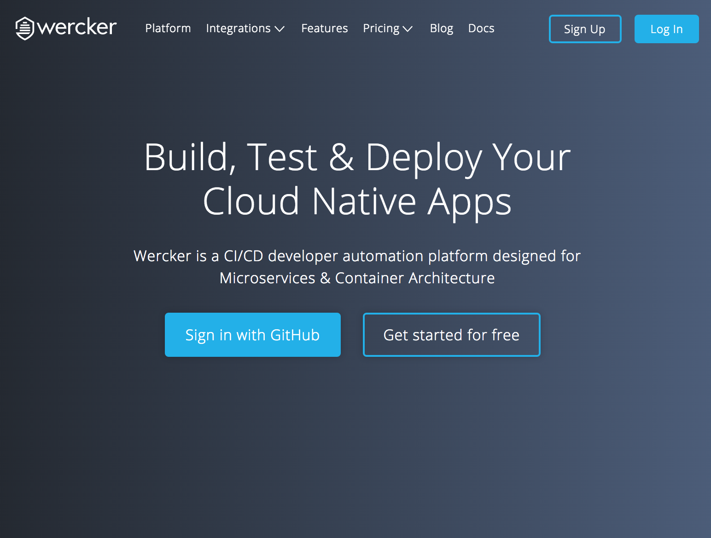
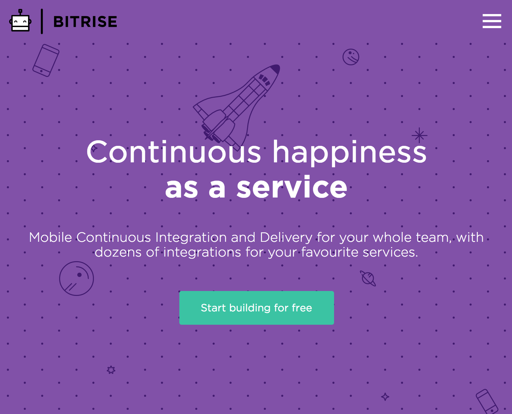
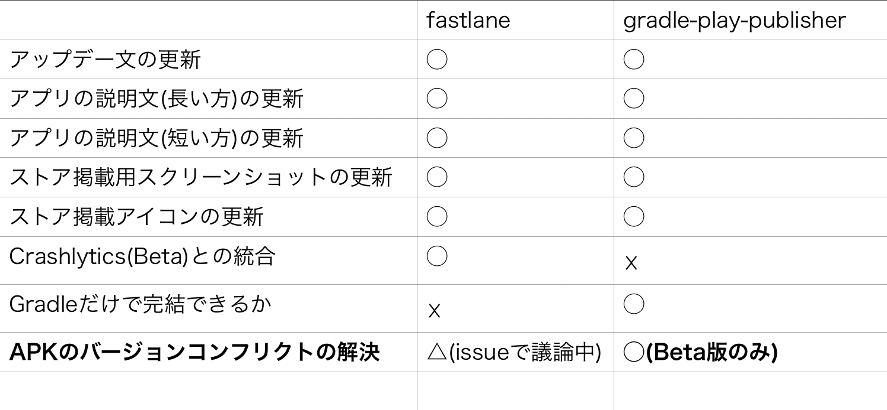

autoscale: true

## リリース自動化の導入と
## 効率のよいリリースフローを求めて

### by Ryo Sakaguchi 
### @Droidkaigi2017 Day.1

---

# About me

- 大阪出身です
- わくわくさんとか呼ばれてます。(会社での布教には失敗した)
- Wantedlyという会社でWantedly Peopleの開発をしています。
- 元おねだん以上な家具屋さんで販売員をしていました。

--- 

---

---

### ScanSnapの動画も載せたら良いのかな

---

### ブースもあるから来てね
### ノベルティもあるよ！

--- 

# Agenda

---
# Agenda

- 自動化の雰囲気
    - 目的やモチベーション、できること、メリットなど
- リリース自動化に関連するツールの紹介
    - Androidアプリのリリースの自動化に役に立つツール群を紹介します。
- どうやってやるのか？（導入準備）
    - いくつかのアプリを例に、自動化したリリースフローを導入することを考えてみます。
- どうやってやるのか？（導入）
    - 実際に導入する際に必要な作業をチェックしていきます。
- 注意点
- まとめ的な
- 質疑応答

---

# Agenda

- **自動化の雰囲気**
    - **目的やモチベーション、できること、メリットなど**
- リリース自動化に関連するツールの紹介
    - Androidアプリのリリースの自動化に役に立つツール群を紹介します。
- どうやってやるのか？（導入準備）
    - いくつかのアプリを例に、自動化したリリースフローを導入することを考えてみます。
- どうやってやるのか？（導入）
    - 実際に導入する際に必要な作業をチェックしていきます。
- 注意点
- まとめ的な
- 質疑応答

---

# 自動化の目的って？

---

# 自動化の目的
- これ
- これ
- これ
- これ

--- 

# こんなことができます

---

# こんなことが可能に
- これ
- これ
- これ
- これ

---

## [fit]もっといろいろできるようになるけど やり過ぎは良くないから注意。 (後述)

---

# [fit]自動化したら何がうれしくなるか🤔

--- 

## 作業がシンプルになってうれしい！

---

## 自動化していないリリース作業は オペレーションミスを生みがち

--- 

## 今までのリリース作業
- これ
- これ
- これ
- これ

---

--- 

## これからのリリース作業

---

# [fit]`git push origin master`

---

# だいたいこれでいける。 これなら…

---

# ミスなくッ
# スピーディにッ
# リリースを回せるッ！

---

## [fit]でもリリース作業ってそんなに回数多くないんじゃ...

---

## [fit]それが、アプリの改善サイクルを 週1で回すと結構大変です

---

## なぜ大変か

- リリースを高速で回していくとどうしてもバグが増えていく。
    - 根本的な解決策としては、きちんとテストを書いてそもそもバグを生みにくい環境を整えることが必要。
    - でも、起きるときは起きる。
    - 結果的に**hotfix**をすることもある
    - その**hotfix**を含めると週に1回じゃすまない
    - そんな時、**リリースができる作業者が1人**だったら？

**とかやってると確実にミスが増えていく**

--- 

## 実際に僕自身がやってしまったこと一覧

- ストアのChangelogの日本語に英語を英語に日本語を入れてしまった
- APKをsplitしていたので、何回かすでにアップロード済みのAPKファイルをアップロードしてしまった(弾かれるので実害はない)

クリティカルすぎるミスは犯してないけど、もう一度関連作業しなければいけないストレスは結構あった。

---

## [fit]そんな時に出会ったのが自動化でした。

--- 

# Agenda

- ~~自動化の雰囲気~~
    - ~~目的やモチベーション、できること、メリットなど~~
- **リリース自動化に関連するツールの紹介**
    - **Androidアプリのリリースの自動化に役に立つツール群を紹介します。**
- どうやってやるのか？（導入準備）
    - いくつかのアプリを例に、自動化したリリースフローを導入することを考えてみます。
- どうやってやるのか？（導入）
    - 実際に導入する際に必要な作業をチェックしていきます。
- 注意点
- まとめ的な
- 質疑応答

---

## [fit]自動化に必要なツール群

---

## 想定環境

- GitFlowを使っている
    - master(リリースブランチ)
    - develop
    - feature
    - hotfix
    - release
- 個人・チームは問わない

---

# CI

---

# [fit]**Wercker**か**Bitrise**がオススメ

    
---

## CI

- **Wercker**
    1. Dockerでコンテナを好きに作ってビルド環境をかなり自由に組み立てることができる
        - Dockerfileが書ければ好きに作れる
    1. 他にもすでに出来上がっているコンテナを使うこともできる。
    1. はやい
    1. サポートがフランクな気がする。
    1. だいたい無料

---

## CI

- **Bitrise**
    1. なんとなくiOSのイメージが強いかもしれないけど、androidのサポートもスゴイしっかりしている。
    1. だいたい基本的にはGUIで完結できるので、ちょっと修正したいときとか便利
    1. WEBのコンソールからビルドをスケジュールして叩くこともできる。
    1. しっかり使うなら有料だけど、制限付きの無料プランもある。
    1. **面倒な署名ファイルの管理を手助けしてくれる**

--- 

## CI

### どっちがいいの？

- 環境構築とビルドフローの構築のしやすさでは**Bitrise**に軍配が上がります。
- 柔軟性と言う観点では**Wercker**かなぁと思っている。

---

## APKのアップロード

---

## APKのアップロード

- 有名所が2つあります。
    1. [Triple-T/gradle-play-publisher](https://github.com/Triple-T/gradle-play-publisher)
    1. [fastlane/fastlane](https://github.com/fastlane/fastlane)

---
## 雑に比較してみました

---

## fastlaneといえばfablic
## fablicといえば

--- 

> Fabric is Joining Google
-- January 18, 2017

---

## ですよね？

---

> fastlane is Joining Google
-- January 23, 2017

---