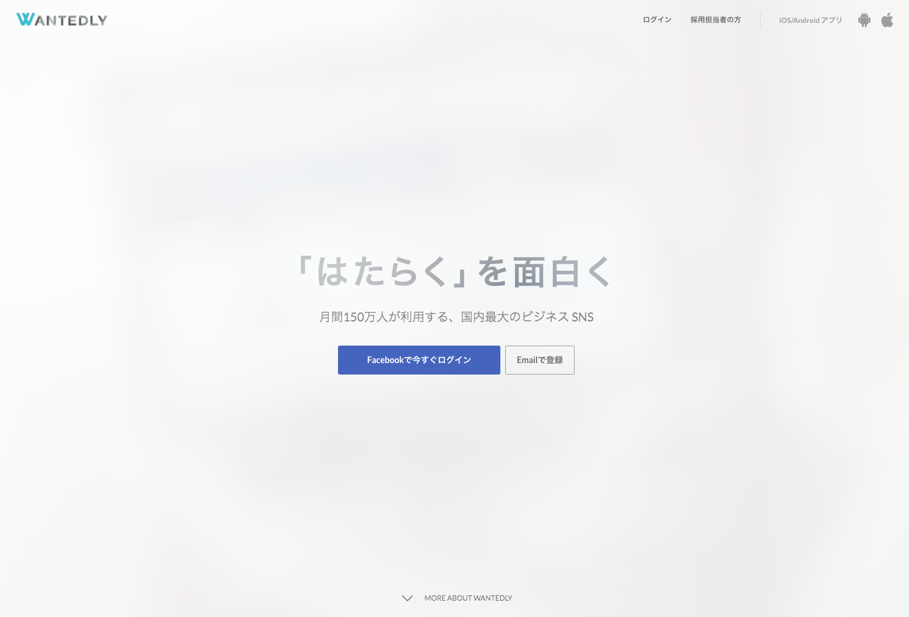

autoscale: true

## [fit]リリース自動化の導入と<BR>効率のよいリリースフローを求めて
### by Ryo Sakaguchi 
### @Droidkaigi2017 Day.1

---

# About me

- わくわくさんとか呼ばれてます。(会社での布教には失敗した)
- **Wantedly🍣** という会社で**Wantedly People**の開発をしています。
- 元おねだん以上な家具屋さんで販売員をしていました。


--- 



---


---


^みれなかったら飛ばす

---

## ブースもあるから来てね！<BR>ノベルティもあるよ！

--- 

# Agenda

---
# Agenda

- 自動化の雰囲気
    - 目的やモチベーション、できること、メリットなど
- リリース自動化に関連するツールの紹介
    - Androidアプリのリリースの自動化に役に立つツール群を紹介します。
- どうやってやるのか？（導入準備）
    - いくつかのプロジェクトを例に、自動化したリリースフローを導入することを考えてみます。
- どうやってやるのか？（導入）
    - 実際に導入する際に必要な作業をチェックしていきます。
- 失敗しがちなケースと注意点
- まとめ的な
- 質疑応答

---

## 今日一番伝えたいこと
- 自動化の詳細な導入手順などではなく、なんでやるのか、モチベーションをメインに伝えていきたいと思います。
- 導入自体は対して難しくない。
- 必要なのはやっていく気持ち

---

# Agenda

- **自動化の雰囲気**
    - **目的やモチベーション、できること、メリットなど**
- リリース自動化に関連するツールの紹介
    - Androidアプリのリリースの自動化に役に立つツール群を紹介します。
- どうやってやるのか？（導入準備）
    - いくつかのプロジェクトを例に、自動化したリリースフローを導入することを考えてみます。
- どうやってやるのか？（導入）
    - 実際に導入する際に必要な作業をチェックしていきます。
- 失敗しがちなケースと注意点
- まとめ的な
- 質疑応答

---

### [fit]そもそも自動化の目的って？

---

# 自動化の目的
- ルーチンワーク、定型作業のようなものなので、自動化することによって、本質的な業務に集中できるようにしたい。
- 管理しているアプリが多くなってきたり、ストア掲載文の多言語対応などをしている場合、更新手順が煩雑になる。
    - そのミスを減らしたい。
- リリース作業を属人化させたくない。

--- 

# [fit]こんなことができます

---

# こんなことが可能に
- Google Play Developer ConsoleへのAPKアップロード(複数APKの一括アップロードもOK！)
- ストア情報の更新
    - Change log
    - Long description
    - Short description
    - ScreenShots
- 監視ツール(CrashlyticsやFirebase Crash Reporting, Bugsnag…) へのmapping.txtファイルのアップロード

---

## [fit]もっといろいろできるようになるけど<BR>やり過ぎは良くないから注意。 (後述)

---

# [fit]自動化したら何がうれしくなるか🤔

--- 

##[fit] 作業がシンプルになってうれしい！

---

## [fit]自動化していないリリース作業は<BR>オペレーションミスを生みがち

--- 

## 今までのリリース作業
- 署名ファイルを持っているリリースマネジャー的な人にリリースをお願いする。
- ProductionAPKを用意する。
- アップデート文を用意する。
- Consoleにアクセスして、WEBインターフェイスでアップロードする
- アップロードを社内に周知
- 更新を社内に通知

を全部手作業

---


--- 

## これからのリリース作業

---

# [fit]`git push origin master`

---


---

# はやい

---

# [fit]だいたいこれでいける。<BR>これなら…
---

# [fit]ミスなくッ！<BR>スピーディにッ！<BR>リリースを回せるッ！

---

## [fit]でもリリース作業ってそんなに回数多くないんじゃ...

---

## [fit]それが、アプリの改善サイクルを<BR>週1で回すと結構大変です

---

## なぜ大変か

- リリースを高速で回していくとどうしてもバグが増えていく。
    - 根本的な解決策としては、きちんとテストを書いてそもそもバグを生みにくい環境を整えることが必要。
    - でも、起きるときは起きる。
    - 結果的に**hotfix**をすることもある
    - その**hotfix**を含めると週に1回じゃすまない
    - そんな時、**リリースができる作業者が1人**だったら？

**とかやってると確実にミスが増えていく**

--- 

## [fit]実際に僕自身がやってしまったこと一覧

- ストアのChangelogの日本語に英語を英語に日本語を入れてしまった
- APKをsplitしていたので、何回かすでにアップロード済みのAPKファイルをアップロードしてしまった(弾かれるので実害はない)

クリティカルすぎるミスは犯してないけど、もう一度関連作業しなければいけないストレスは結構あった。

---

## [fit]そんな時に出会ったのが自動化でした。

--- 

# Agenda

- ~~自動化の雰囲気~~
    - ~~目的やモチベーション、できること、メリットなど~~
- **リリース自動化に関連するツールの紹介**
    - **Androidアプリのリリースの自動化に役に立つツール群を紹介します。**
- どうやってやるのか？（導入準備）
    - いくつかのプロジェクトを例に、自動化したリリースフローを導入することを考えてみます。
- どうやってやるのか？（導入）
    - 実際に導入する際に必要な作業をチェックしていきます。
- 失敗しがちなケースと注意点
- まとめ的な
- 質疑応答

---

## [fit]自動化に必要なツール群

---

## 想定環境

- GitFlowを使っている
    - master(リリースブランチ)
    - develop
    - feature
    - hotfix
    - release
- 個人・チームは問わない

---

# CI

---

# [fit]**Wercker**か**Bitrise**がオススメ


    
---

## CI

- **Wercker**
    1. Dockerでコンテナを好きに作ってビルド環境をかなり自由に組み立てることができる
        - Dockerfileが書ければ好きに作れる
    1. 他にもすでに出来上がっているコンテナを使うこともできる。
    1. はやい
    1. サポートがフランクな気がする。
    1. だいたい無料


---

## CI

- **Bitrise**
    1. なんとなくiOSのイメージが強いかもしれないけど、androidのサポートもスゴイしっかりしている。
    1. だいたい基本的にはGUIで完結できるので、ちょっと修正したいときとか便利
    1. WEBのコンソールからビルドをスケジュールして叩くこともできる。
    1. しっかり使うなら有料だけど、制限付きの無料プランもある。
    1. **面倒な署名ファイルの管理を手助けしてくれる**


--- 

## CI

### どっちがいいの？

- 環境構築とビルドフローの構築のしやすさでは**Bitrise**に軍配が上がります。
- 柔軟性と言う観点では**Wercker**かなぁと思っている。

---

## APKのアップロード

---

## APKのアップロード

- 有名所が2つあります。
    1. [Triple-T/gradle-play-publisher](https://github.com/Triple-T/gradle-play-publisher)
    1. [fastlane/fastlane](https://github.com/fastlane/fastlane)

---
## 雑に比較してみました


---

## 比較はしましたけど

みなさんがお気づきのように大差はありません。
どちらでも好きな方を使えばいいと思います。
締りの悪い比較になってしまいました…

---

# ですが

___

## fastlaneといえばfablic
## fablicといえば

--- 

> Fabric is Joining Google
-- January 18, 2017

---

## ですよね？

---

> fastlane is Joining Google
-- January 23, 2017

---

# [fit]今後に期待！

---

## その他のツール

---

## その他のツール

- Tonkotsu
    - GooglePlayの更新をSlackに通知！
    - PlayConsoleアプリを入れてない人や社内に通知するときとかにとても役立ちます。

---

## [fit]だいたいこのツールだけで自動化を実践することができます。

---

# Agenda

- ~~自動化の雰囲気~~
    - ~~目的やモチベーション、できること、メリットなど~~
- ~~リリース自動化に関連するツールの紹介~~
    - ~~Androidアプリのリリースの自動化に役に立つツール群を紹介します。~~
- **どうやってやるのか？（導入準備）**
    - **いくつかのプロジェクトを例に、自動化したリリースフローを導入することを考えてみます。**
- どうやってやるのか？（導入）
    - 実際に導入する際に必要な作業をチェックしていきます。
- 失敗しがちなケースと注意点
- まとめ的な
- 質疑応答

---

# 導入準備編

---

# [fit]その自動化ほんとうに必要ですか？

---

## 本当に必要ですか？

- なぜ自動化するのか
    - これについて突き詰めて考えていくと実際はしなくてもいいケースは存在します。
    - 何をどう自動化するかが自ずと見えてきます。
    - それができたら導入準備が終ったみたいなもんです。
    - 自動化するメリットがあるな、と感じたら実際に作業にとりかかりましょう。
    - メリットが感じられたら、**「foobarだから自動化したい。だから少し時間くれ」**的なお話をチームですると良いと思います。
    - 個人なら気にせずやってしまいましょう。
    
^Whyから考える大事さ。
^幾つかのプロジェクトを例に考えていければと思っています。

---

## Case.1

^必要ないケースを書く（国内向けアプリ）

---

## Case.1
### 完全に国内向けのケース

---
## Case.1
### 完全に国内向けのケース
→ **場合によっては自動化しなくても良い**

---

## Case.1
なぜか？

- リリースにかかる負担がそこまで大きくないと想定できるため。
    - 多言語対応時に多くのアップデート文を書く必要があるが、完全国内向けの場合はその工数がかからない。

^ここで言う自動化はGooglePlayへのリリースが主です。
^DeployGateやfablicへのアップロードなどは積極的に自動化していつでもテストやベータビルドを触って新機能やバグフィックス版をドッグフーディングしていきましょう
^APKSplitをしていて、複数APKがある場合なんかも積極的に自動化していくと言いです。

---

## Case.2

^とても有効なケースを書く（グローバルなアプリ）

---

## Case.2
###グローバルに展開していてローカライズも豊富なアプリ

---

## Case.2
グローバルに展開していてローカライズも豊富なアプリ
→ **ぜひ自動化したい**

---

## Case.2
なぜか？

^何度もいってるけどアップデート文の更新をWEBでやるの結構面倒。

- アップデート文を温かみのある手作業で繰り返していく必要がある。
- 正直かなりつらい。
- APKのアップロードだけではなくストア情報の更新も本当に億劫になる。
- 14言語 x 5枚のスクリーンショットをアップロードすることがあったらどうしよう。

^こんなん手作業でやってたら最悪の場合死に至るんじゃないかって気がする。
^とにかくつらそう

---

## Case.3

^比較的有効なケースを書く（主に国内向け、だけどnativeライブラリを使用しているケース）

---

## Case.3
### 主に国内向け、だけどNDKを使ったり、Realmを使ったりしている場合

---

## Case.3
### 主に国内向け、だけどNDKを使ったり、Realmを使ったりしている場合
→ **APK Splitをして、アプリサイズを削減している場合**はとっても効果的です

---

## APK Split？

```
```

---

## APK Split？

```groovy

splits {
    abi {
        enable true
        reset()
        include 'x86', 'armeabi', 'armeabi-v7a'
        universalApk false

        // trueにすると分解したAPKの他に
        // 今までビルドしていたAPKも出力されます。
        // fablicやDeployGateにアップロードする際に効果的
    }
}

```

^こういうのをGradleに書いてあげると良い。
^こうすることで、不要なアーキテクチャのファイルがAPKに含まれなくなるので、結果的にアプリサイズの削減につながります。
^Realmをつかっているアプリにもとても有効です

--- 

## Case.3
### なぜSplitしているときは効果的か？

---

## Case.3
### なぜSplitしているときは効果的か？
→ アプリが複数に分かれます。<BR>上記の例だと**universalAPK**を除いて**3つのAPK**が出来上がります。

### [fit]こんなんいちいち手でポチポチやってられません。

なので自動でアップロードして楽をしていこうと言うスタイルです。
アプリのサイズは国内だとそうでも無いかもしれませんが、海外だと継続率に影響します。

#### なのでもし該当される人がいらっしゃったらぜひ導入してみてください！

^前職では14言語に対応するアプリの開発をしていて、アクセスのない国は北朝鮮くらいって感じのアプリを作っていた。
^いっときアプリのDLサイズが19MBを超えたくらいからちらほらとレビューに「サイズでかいから消します＞＜」的なのが出始めた。
^Splitしてからはそういったレビューも減ったので、とても良い施策だったと思います。

---

# Agenda

- ~~自動化の雰囲気~~
    - ~~目的やモチベーション、できること、メリットなど~~
- ~~リリース自動化に関連するツールの紹介~~
    - ~~Androidアプリのリリースの自動化に役に立つツール群を紹介します。~~
- ~~どうやってやるのか？（導入準備）~~
    - ~~いくつかのプロジェクトを例に、自動化したリリースフローを導入することを考えてみます。~~
- **どうやってやるのか？（導入）**
    - **実際に導入する際に必要な作業をチェックしていきます。**
- 失敗しがちなケースと注意点
- まとめ的な
- 質疑応答

---

# 導入編

---

## [fit]実際に手順とコードで導入から配信までを追っていきましょう！

---

## 今回の要件(あくまでも想定です)

^前述のCase.2を例に考えたいと思います。

- 状況
    - あなたは5人で構成された開発チームのAndroidエンジニアです。
    - アプリは国際展開しており、翻訳も外部に依頼していたりします。
    - この1ヶ月、サービスグロースのために、1週間に1回のリリースサイクルを回していく事になりました。
    - チームにはビジネスサイドの人も居ます。また、CSチームからはリリースがされたらいち早く教えてほしいと言われています。
    - アプリ内のDBにはRealmを使用しています。

---

## 温かみのある手作業(1/3)

- リリース前になり、今回のアップデート文を考え、10言語分の翻訳依頼を出しました。
- 翻訳を待つ間、最終確認のテストを行いました。
- テスト完了後、APKをビルドしました。
- 翻訳がされたアップデート文すべてが手元に揃いました。
- いざアップロードです。
- アプリサイズの肥大化を抑制するために、APK splitを使うことにしたので、全部で5つのAPKをアップロードすることになりました。

---

## 温かみのある手作業(2/3)

- GooglePlay Developer Consoleへアクセスします。
- APKをアップロードし(x5)、各言語ごとにアップデート文をコピペしていきます(x10)。
- いざ公開ボタンを押します！

---

- GooglePlay Developer Consoleへアクセスします。
- **APKをアップロードし(x5)、各言語ごとにアップデート文をコピペしていきます(x10)。**
- いざ公開ボタンを押します！

---

## [fit]**APKをアップロードし(x5)<BR>アップデート文を入力します(x10)**

---

## 温かみのある手作業(3/3)

^まだ続きます

- APKをアップロード後、CSチームと開発チームに「アップロードが完了しました」と周知します。
- ストアの更新をPlayConsoleアプリの通知で確認できたので、CSチームにもう一度連携します。

---

## 結構大変感ある。

---

## では自動化するとどうなるか

---

## [fit]今回はサクッとできる自動化で考えたいと思います。

1. ~~GooglePlay Developer Consoleへアクセスします。~~
→ **すべてローカルで準備&完結しましょう** by **fastlane**

---

## [fit]今回はサクッとできる自動化で考えたいと思います。

1. ~~GooglePlay Developer Consoleへアクセスします。~~
→ **すべてローカルで準備&完結しましょう** by **fastlane**

1. ~~APKをアップロードし(x5)、各言語ごとにアップデート文をコピペしていきます(x10)。~~
→ **プログラムに任せましょう** by **fastlane && CI**

---

## [fit]今回はサクッとできる自動化で考えたいと思います。

1. ~~GooglePlay Developer Consoleへアクセスします。~~
→ **すべてローカルで準備&完結しましょう** by **fastlane**

1. ~~APKをアップロードし(x5)、各言語ごとにアップデート文をコピペしていきます(x10)。~~
→ **プログラムに任せましょう** by **fastlane && CI**

1. ~~APKをアップロード後、CSチームと開発チームに「アップロードが完了しました」と周知します。~~
→ **Slackで自動的に通知する仕組みを作りましょう** by **Slack & CI**

---

## [fit]今回はサクッとできる自動化で考えたいと思います。

1. ~~GooglePlay Developer Consoleへアクセスします。~~
→ **すべてローカルで準備&完結しましょう** by **fastlane**

1. ~~APKをアップロードし(x5)、各言語ごとにアップデート文をコピペしていきます(x10)。~~
→ **プログラムに任せましょう** by **fastlane && CI**

1. ~~APKをアップロード後、CSチームと開発チームに「アップロードが完了しました」と周知します。~~
→ **Slackで自動的に通知する仕組みを作りましょう** by **Slack & CI**

1. ~~ストアの更新をPlayConsoleアプリの通知で確認できたので、CSチームにもう一度連携します。~~
→ **こちらもSlackで自動的に通知する仕組みを作りましょう** by **tonkotsu**

---

## これだけでもだいぶ楽になりますよ！
## では実現していきましょう。

---

## Step.1(1/2)
まずはfastlaneの準備から

^細かいセットアップまで話していると圧倒的に時間が足りないので、要約だけでしつれいします！
^セットアップ方法はfastlaneのリポジトリ公式が一番くわしいです。
^資料の最後にリンクを載せておきますので安心してください！

- fastlaneがGooglePlay Developer ConsoleにアクセスするためのService Accountを作り、生成される`json`ファイルを用意します。
- 次にfastlaneのインストールを行います。

```
gem install fastlane
```


---

## Step.1(2/3)

- fastlaneを使ってGoogelPlayから**現在の最新のストア掲載情報**を取得し、git管理下におきましょう。
    − この時注意したいのが、先程ダウンロードしたjsonファイルはgitのリポジトリに入れないようにしてください。

^この辺の工夫は時間がないのでまた個別に聞いていただけると嬉しいです！

```sh
> cd your_project_folder
> fastlane supply init -j /path/to/json
> git add .
> git push
```
---
## Step.1(3/3)

こんな感じでアップデート文がはいったディレクトリがプロジェクトフォルダ内に生成されます。
アップデートを配信する際はテキストファイルにバージョンコードの名前をつけて、アップロードすることでストアに更新がかかります。

```
metadata
        └── android
            ├── en-US
            │   └── changelogs
            │       ├── 100000.txt // バージョンコードがファイル名になる
            │       └── 100100.txt
            └── ja-JP
                └── changelogs
                    └── 100100.txt
```

**fastlaneの準備は以上です。**

---

## Step.2(1/2)

- CIがmasterプッシュに反応して、リリースビルドを作成し、fastlaneを叩く用に設定しましょう。

^各CIサービスによって違いがあります！今回は例としてwerckerを使用しました。
^CIのサービスの基本的な設定(ビルドの設定など)は今回は含みません。
^werckerやBitriseはそのあたりはGUIで操作できるので迷うことはすくないとおもいます。
^わからない場合は聞いてくれればお答えします。

```yml

release:
  steps:
    - script:
        name: Upload to GooglePlay.
        code: |
          ls -la $WERCKER_REPORT_ARTIFACTS_DIR
          ./script/deploy/deploy2googleplay.sh
```

---

## Step.2(2/2)
- /deploy2googleplay.shの中身

```sh
fastlane supply run -p com.wakwak.awsomeglobalapp \
-j ./app/signingConfigs/json_key.json \
-u \
"./app/build/outputs/apk/app-production-arm64-v8a-release.apk",\
"./app/build/outputs/apk/app-production-armeabi-release.apk",\
"./app/build/outputs/apk/app-production-armeabi-v7a-release.apk",\
"./app/build/outputs/apk/app-production-mips-release.apk",\
"./app/build/outputs/apk/app-production-x86-release.apk",\
"./app/build/outputs/apk/app-production-x86_64-release.apk" \
--verbose --skip_upload_images --skip_upload_screenshots

```

ここまでやれば<BR>とりあえず**ビルド→リリース**は完成します

---

## Q.なんかめんどくさそう？

---

## [fit]A.はい。わりと工程長いです。
## [fit]これでもめっちゃ省いてます。

---

## 意外に面倒

- 自動化のフローを組み立てるのはとても楽しいですが、最初はこまごました作業が多いのでちょっと面倒に感じるかもしれません。
- 温かみのある手作業リリースをやめるには温かみのある作業によって意外はなしえません。
- ベストなのはリポジトリのオーナーが最初にガッ！っと作業してしまうこと。

---

## Step.3(1/2)
- アップロード完了を通知しましょう

releaseというchannelにビルド完了を通知するstepを追加します。

```yml
after-steps:
     - slack-notifier:
                 url: $SLACK_URL_RELEASE
                 channel: release
                 username: wercker
```

---

## Step.3(2/2)

- 全体ではこんな感じになるかと思います。

```yml
release:
  steps:
    - script:
        name: Upload to GooglePlay.
        code: |
          ls -la $WERCKER_REPORT_ARTIFACTS_DIR
          ./script/deploy/deploy2googleplay.sh
  after-steps:
     - slack-notifier:
                 url: $SLACK_URL_RELEASE
                 channel: release
                 username: wercker
```

---

## Step.4 (1/1)
- ストアの更新を通知しましょう

[tonkotsu](operando/tonkotsu)を使います
設定方法はリポジトリに詳しく書いてあります。

```go
> go run tonkotsu.go config.go -c config.toml
```

- これで、ストアが更新された時にSlackの通知を送ることができるので、起動だけしておけば他の作業に集中できます

---

## これだけ準備しておけば後は

---

## [fit]　(だいたい) git push origin master

---

## でOKです

^さっきもちょっとでましたけど、自動化する作業自体は面倒です。
^ですが、実現後はメリット大きいので将来的に十分お釣りが来ると思います！

---

# Agenda

- ~~自動化の雰囲気~~
    - ~~目的やモチベーション、できること、メリットなど~~
- ~~リリース自動化に関連するツールの紹介~~
    - ~~Androidアプリのリリースの自動化に役に立つツール群を紹介します。~~
- ~~どうやってやるのか？（導入準備）~~
    - ~~いくつかのプロジェクトを例に、自動化したリリースフローを導入することを考えてみます。~~
- ~~どうやってやるのか？（導入）~~
    - ~~実際に導入する際に必要な作業をチェックしていきます。~~
- **失敗しがちなケースと注意点**
- まとめ的な
- 質疑応答

---

## [fit]失敗しがちなケースと注意点

---

## Case.1
## [fit]何でもかんでも自動化しようとする

---

## 何でもかんでも自動化しようとする

- 前述しましたが、自動化の作業自体は**面倒**で色々やらなきゃいけないです。
- なので、リリースサイクルの中でボトルネックになっているところに限定して自動化を適用することで効果が最大化されます。

---

## たとえば
- リリース通知のTwitterや社内の情報共有ツールに更新内容を投稿しよう！
    - 素晴らしいとは思いますが、本来は各ツールに直接書いていくほうが柔軟性が高いものをいちいち自動化するとオレオレ更新手順が発生します。
    - 過度な自動化は属人性を高めてしまうと思っています。

---

## Case.2
## [fit]自分がリポジトリオーナーではない

---

## [fit]自分がリポジトリオーナーではない

- 自動化するにあたってはセンシティブなファイルや情報を扱うことになります。
- そんな時に、その人に都度情報の確認をして自動化フローを追加していくのは難しいです。
- なるべく自動化はリポジトリオーナーに近い状態で実施することで導入のしやすさがかわります。
- レールを敷いてあげると後続の開発者はそこにのっかっていきます。

---

# Agenda

- ~~自動化の雰囲気~~
    - ~~目的やモチベーション、できること、メリットなど~~
- ~~リリース自動化に関連するツールの紹介~~
    - ~~Androidアプリのリリースの自動化に役に立つツール群を紹介します。~~
- ~~どうやってやるのか？（導入準備）~~
    - ~~いくつかのプロジェクトを例に、自動化したリリースフローを導入することを考えてみます。~~
- ~~どうやってやるのか？（導入）~~
    - ~~実際に導入する際に必要な作業をチェックしていきます。~~
- ~~失敗しがちなケースと注意点~~
- **まとめ的な**
- 質疑応答

---

## まとめてみます

--- 

## まとめ
- 自動化は工数がかかるので、導入する個所を決定してからそこだけをやること。
    - 「ここまでいるかな...？」って一回でも思ったらその部分に関してはやらない。
- そもそも自動化の必要ないプロジェクトもある。
    - チームで話し合ってみると良いかもしれない。
- 自動化するとメリットはある。なので、積極的に検討していってほしい！

---

## [fit]以上です！<BR>ご清聴ありがとうございました！

---

## [fit]オフィスアワーと<BR>Wantedlyブースでまってます！

---